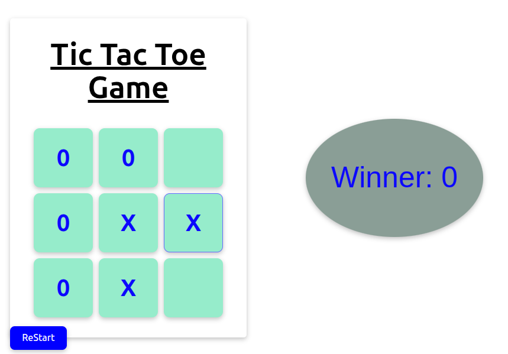

## Tic Tac Toe Game

A simple React + Vite implementation of Tic Tac Toe.

### Screenshot



### Quick Start

```bash
cd "game"
npm install
npm run dev -- --open
```

### Tech Stack

- React (Vite)
- JavaScript

### Project Structure

```
Tic Tac Toe Game/
  game/
    public/
      vite.svg
    src/
      App.jsx
      main.jsx
```

### Notes

- The screenshot currently shows the Vite logo as a placeholder. Replace `game/public/vite.svg` with a real screenshot (e.g., `screenshot.png`) and update the path above if desired.


